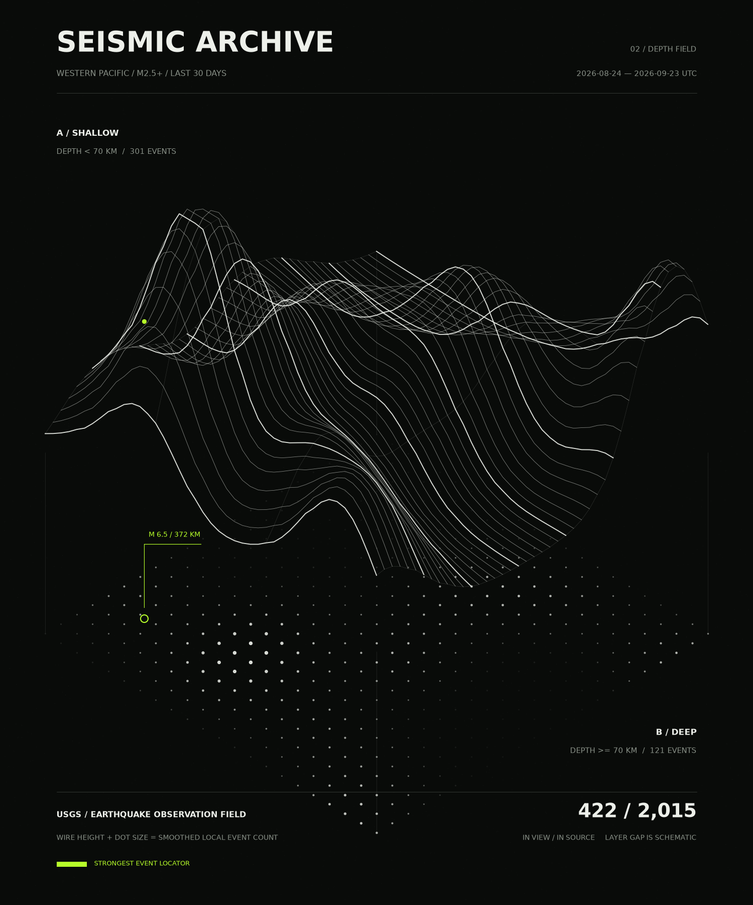

# Seismic Relief



## The phenomenon

Earthquakes happen when accumulated stress is released along faults in the Earth's
crust. Their locations are not evenly distributed: many occur in long belts near
tectonic plate boundaries. I chose earthquakes because I wanted to see whether
their spatial pattern could become a field of lines rather than a conventional map
covered with markers. The western Pacific was especially useful because a large
number of events form a strong, curved structure across the region.

## The source

The raw file comes from the [USGS past-month feed for earthquakes of magnitude 2.5
or greater](https://earthquake.usgs.gov/earthquakes/feed/v1.0/summary/2.5_month.geojson).
It contains 2,015 GeoJSON features. Each feature represents one recorded earthquake
and includes longitude and latitude in degrees, depth in kilometres, magnitude, and
time in milliseconds since the Unix epoch. The downloaded reply is stored unchanged
in `data/usgs-earthquakes-2.5-month.geojson`, so the drawing runs without internet
access.

## What the picture shows

The picture focuses on 422 events within the western Pacific crop and divides them
at a depth of 70 kilometres. The upper wire surface is made from 301 shallow events;
its height shows their smoothed local count. The lower dot field is made from 121
deep events, with larger dots where more deep earthquakes occur. The fluorescent
green open circle marks the strongest event in the crop (magnitude 6.5 at a depth
of 372 kilometres), while the filled point projects its longitude and latitude onto
the upper field. The gap between layers is a visual device rather than a true depth
scale, and the raised surface is not terrain. This transformation hides coastlines,
individual times and most magnitudes. It also omits events outside the selected
region and softens small local differences through smoothing.

## Run it

```
uv run plot.py
```
